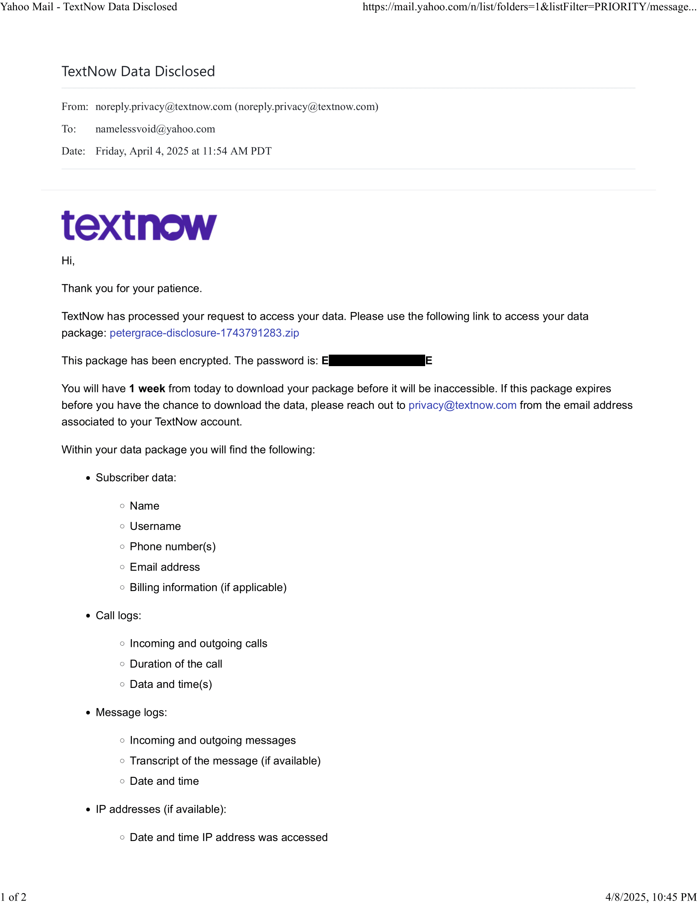

# tde -- TextNow Data Extractor
## The Problem
I requested my call and text message history from my cell phone provider, TextNow, in preparation for a potential court case, because the defendant admitted her wrongdoing in several text messages and a voicemail. 

I could have taken screenshots of the text messages, but photos can be altered, and a lawyer instructed me that I want to avoid a situation where it was my word against hers. So to preclude this, I used the same method that a law enforcement agency or an attorney would use to subpoena the information.

As the following email shows, the data download is separated into multiple files and folders. 


 

The pertinent files are calls.json, messages.json, and user_shard.json which contains my contact list, and have the following format. 

messages.json:
```
{
    "username": "petergrace",
    "device_id": "",
    "direction": 1,
    "contact_value": "+15038902176",
    "contact_name": "1 (503) 890-2176",
    "date": "2016-03-20T00:52:05.000Z",
    "message": "Ok. Stop by and see it later when you can.",
    "read": 1,
    "deleted": 0
  },
```

calls.json
```
  {
    "start_time": "2016-06-06T22:13:18.000+00:00",
    "duration": 128.0,
    "caller": "+15038885253",
    "called": "+15037564626"
  },
```

user_shard.json:

```
{
    "users": [...],
    "user_attributes": [...],
    "sessions": [...],
    "subscriptions": [...],
    "identities": [...],
    "devices": [...],
    "contacts": [...]
}
```
## The Solution

Write a Python script to merge the relevant files and convert it into human-readable format.
